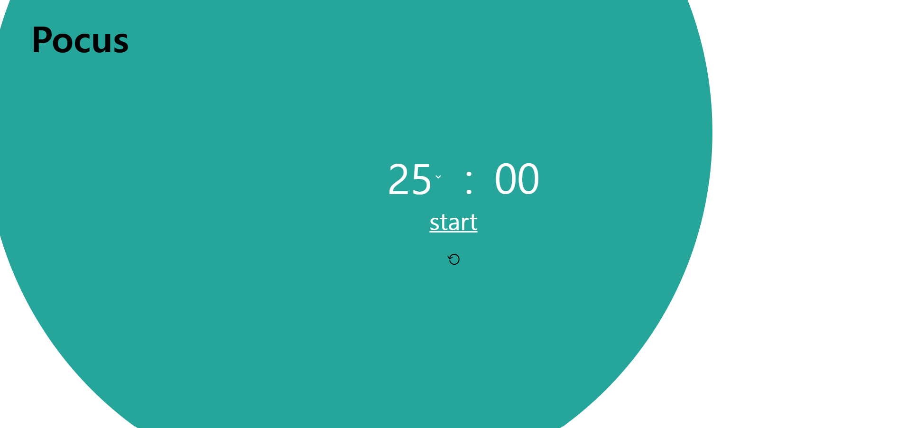

# Pomodoro Time Manager

집중력 향상에 도움을 줄 수 있는 여러 타이머를 포함한 웹사이트 입니다.

## 목적

필요한 기능만 남겨 시간 관리에 방해가 되지 않고 효율적으로 도와주는 도구를 제공합니다.

## 주요 기능

- Pomodoro 기법의 타이머
- 원하는 대로 커스텀할 수 있는 타이머
- 스톱워치
- 다크모드 설정

## 스크린샷

## 기술 스택

- Frontend: HTML, CSS, JavaScript

## 설명

1. Pomodoro Timer
   
   시간을 25, 30, 40, 50 분 단위로 설정하여 Pomodoro 기법에 따라 공부를 할 수 있다.
2. Custom Timer
   
   
   자신의 마음대로 타이머의 시간, cycle, 쉬는 시간을 설정할 수 있다.
3. Stopwatch
   
4. 시간을 측정할 때 사용할 수 있다.
5. Setting - 다크모드를 설정할 수 있고 Pomodoro의 기본 값을 설정할 수 있다.
